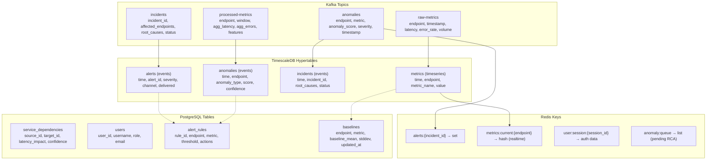
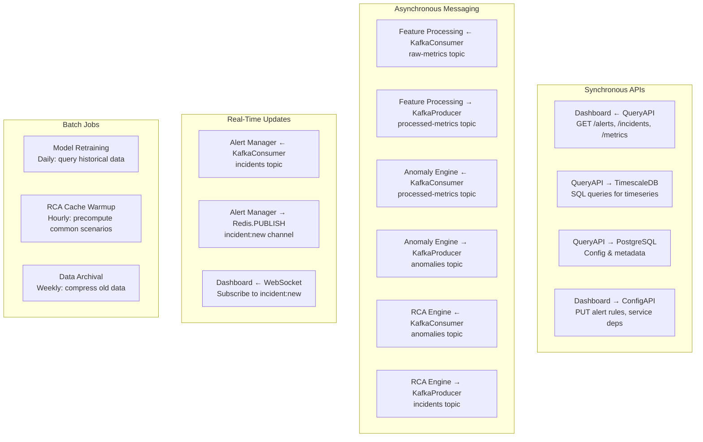
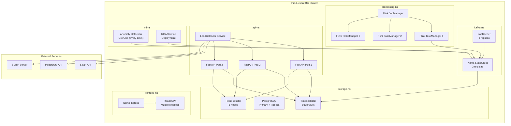
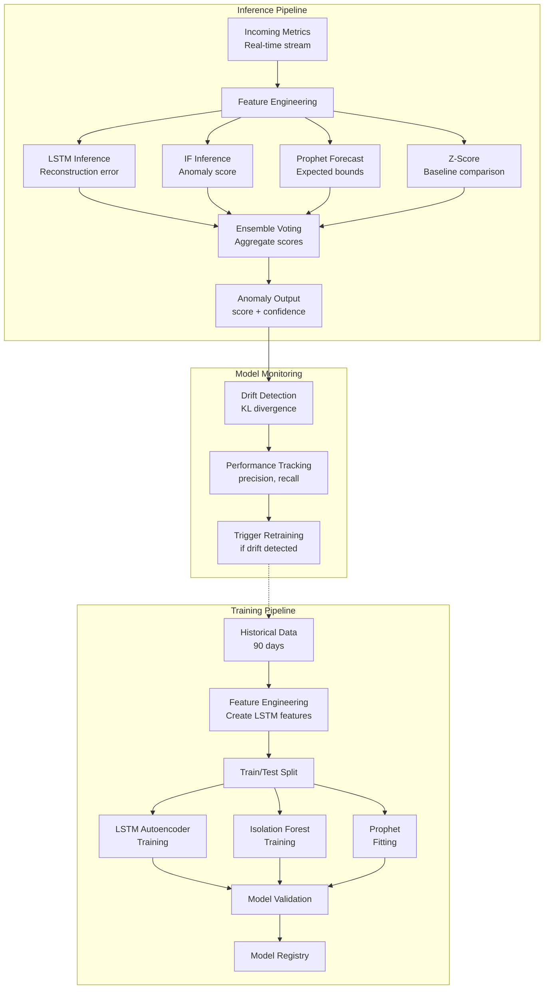
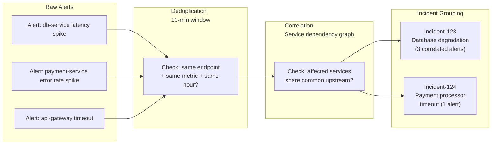
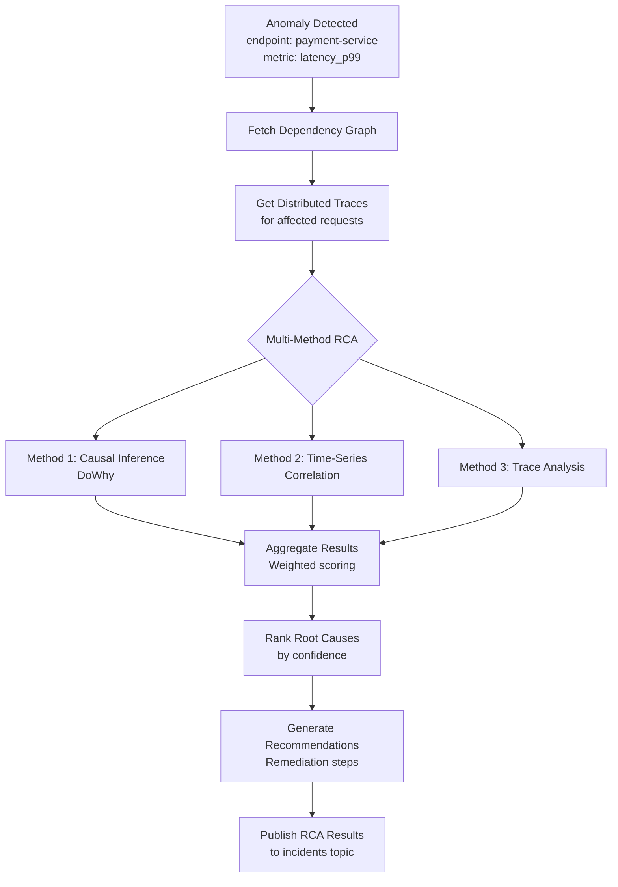

# API Degradation Detection System - Architecture Diagram

## High-Level System Architecture

```mermaid
graph TB
    subgraph "API Services Layer"
        S1["Service A"]
        S2["Service B"]
        S3["Service C"]
        S4["Service D"]
    end

    subgraph "Metrics Collection"
        P1["Prometheus Exporter"]
        OT1["OpenTelemetry Collector"]
        CE["Custom Exporters"]
    end

    subgraph "Streaming Layer"
        K["Kafka Cluster"]
        K1["raw-metrics"]
        K2["processed-metrics"]
        K3["anomalies"]
        K4["incidents"]
    end

    subgraph "Stream Processing"
        FPS["Feature Processing Service<br/>Flink/Spark"]
        FPS1["Windowing Engine"]
        FPS2["Baseline Calculator"]
        FPS3["Drift Detector"]
    end

    subgraph "AI/ML Engines"
        AD["Anomaly Detection Engine"]
        LSTM["LSTM Autoencoder"]
        IF["Isolation Forest"]
        STAT["Statistical Methods"]
        PROPHET["Prophet TS"]
    end

    subgraph "Root Cause Analysis"
        RCA["RCA Engine"]
        CAUSAL["Causal Analysis"]
        TRACE["Trace Correlation"]
        DEP["Dependency Analysis"]
    end

    subgraph "Alert & Incident Management"
        AM["Alert Manager"]
        DED["Deduplication Engine"]
        ROUTE["Alert Router"]
        NOTIF["Notification Service"]
    end

    subgraph "Storage Layer"
        TSDB["TimescaleDB<br/>Metrics & Events"]
        PG["PostgreSQL<br/>Metadata & Config"]
        REDIS["Redis<br/>Cache & Pub/Sub"]
    end

    subgraph "Dashboard & API"
        API["FastAPI Query Server"]
        DASH["React Dashboard"]
        CONFIG["Configuration UI"]
    end

    subgraph "Notifications"
        SLACK["Slack"]
        PD["PagerDuty"]
        EMAIL["Email"]
    end

    %% Connections
    S1 --> P1
    S2 --> P1
    S3 --> OT1
    S4 --> OT1
    S1 --> CE
    
    P1 --> K1
    OT1 --> K1
    CE --> K1
    
    K1 --> FPS
    FPS --> FPS1
    FPS --> FPS2
    FPS --> FPS3
    FPS --> K2
    
    K2 --> AD
    AD --> LSTM
    AD --> IF
    AD --> STAT
    AD --> PROPHET
    AD --> K3
    
    K3 --> RCA
    RCA --> CAUSAL
    RCA --> TRACE
    RCA --> DEP
    RCA --> K4
    
    K4 --> AM
    AM --> DED
    AM --> ROUTE
    AM --> NOTIF
    
    FPS --> TSDB
    AD --> TSDB
    RCA --> TSDB
    AM --> TSDB
    
    TSDB --> API
    PG --> API
    REDIS --> API
    
    API --> DASH
    API --> CONFIG
    REDIS --> DASH
    
    NOTIF --> SLACK
    NOTIF --> PD
    NOTIF --> EMAIL
    
    DASH -.WebSocket.-> REDIS
```

## Component Interaction Diagram

```mermaid
graph LR
    subgraph "Real-Time Processing Pipeline"
        RAW["Raw Metrics<br/>Kafka"]
        FP["Feature Processing"]
        PROC["Processed Metrics<br/>Kafka"]
        AD["Anomaly Detection"]
        ANOM["Anomalies<br/>Kafka"]
    end

    subgraph "RCA & Alerting"
        RCA["Root Cause Analysis"]
        AMW["Alert Manager"]
        INC["Incidents<br/>Kafka"]
    end

    subgraph "Persistence"
        CACHE["Redis Cache"]
        DB["TimescaleDB"]
    end

    subgraph "Presentation"
        API["Query API"]
        DASH["Dashboard"]
    end

    RAW -->|throughput: 100K-1M/sec| FP
    FP -->|latency: 1-5 min| PROC
    PROC -->|throughput: 50K-500K/sec| AD
    AD -->|latency: 100-500ms| ANOM
    ANOM -->|latency: 500ms-5sec| RCA
    RCA -->|confidence scores| AMW
    AMW -->|incident created| INC
    
    ANOM -->|write| DB
    PROC -->|write| DB
    INC -->|write| DB
    
    AD -->|update state| CACHE
    ANOM -->|publish| CACHE
    
    DB -->|query| API
    CACHE -->|query| API
    API -->|REST/WebSocket| DASH
```

## Data Model Architecture

## Service Communication Matrix

## Deployment Architecture (Kubernetes)

## ML Pipeline Architecture

## Alert Deduplication & Correlation

## RCA Process Flow

These diagrams visualize:
1. **Overall system architecture** with all major components
2. **Component interactions** and data flow timing
3. **Data model** in Kafka topics and databases
4. **Service communication patterns** (sync/async/realtime)
5. **Kubernetes deployment structure**
6. **ML training and inference pipelines**
7. **Alert deduplication and correlation logic**
8. **RCA analysis process**
